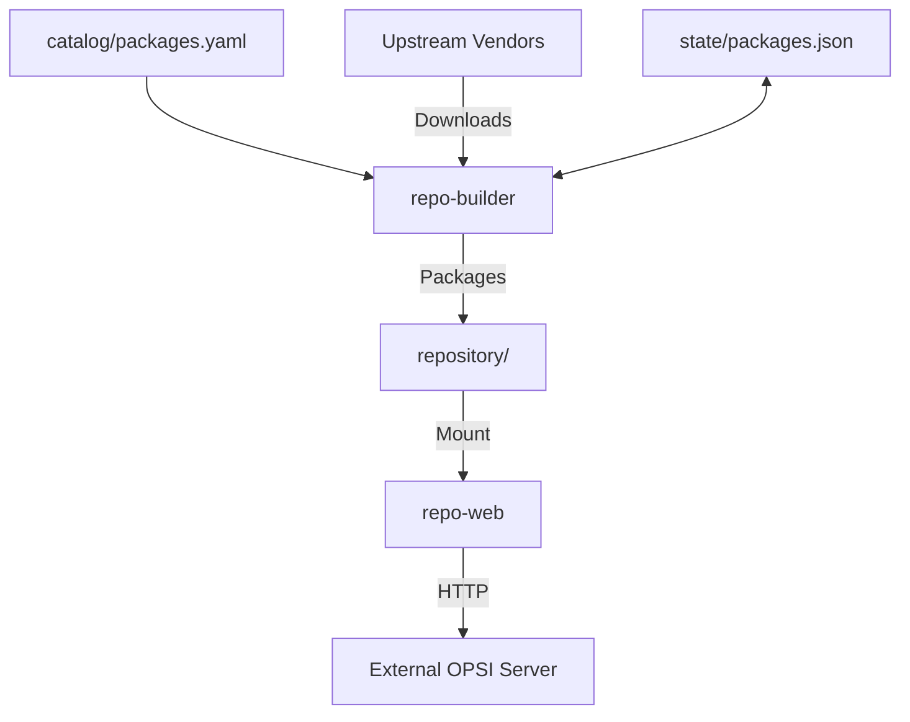
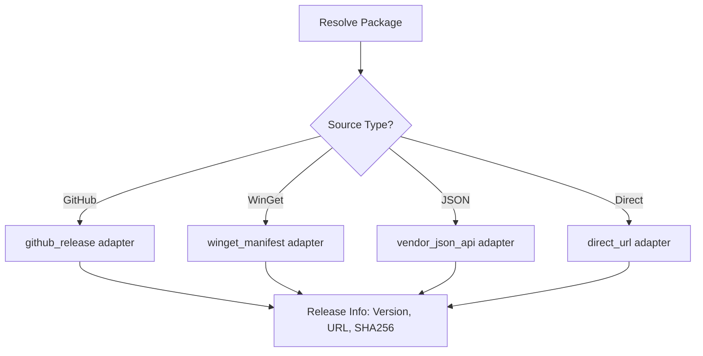

# Project Overview

The `auto-opsi-repo` project provides an automated, self-hosted Docker stack for managing a private OPSI 4.3 software repository. It discovers upstream Windows software releases, downloads official installers, packages them into `.opsi` archives, and serves them over HTTP. This system allows OPSI clients to install vendor software without requiring WinGet or direct internet access on the client side.

The architecture runs alongside an existing OPSI server without modifying the server's configuration or scheduling deployments automatically. It functions through a cyclic builder process that monitors a central package catalog, handles version tracking via persistent state, and performs atomic updates to the repository metadata.

## System Architecture

The project consists of two primary Docker services: a Python-based builder and an Nginx-based web server.

*   **repo-builder**: A Python application utilizing official OPSI 4.3 CLI tools. It runs on a configurable six-hour interval to check for updates, download installers to a private `work/` directory, and generate packages.
*   **repo-web**: An Nginx server that provides a read-only mount of the repository. It serves `.opsi` files and generated metadata via HTTP (default port 8088).



## Core Components

### Package Catalog
The `catalog/packages.yaml` file defines all products. Each entry specifies source settings, installer arguments, detection methods, and uninstallation configurations. No application logic is embedded in the Python source; the builder consumes this YAML to determine its actions.

### Repository Builder (`repo-builder`)
The builder manages the lifecycle of a package. It performs version resolution, verifies checksums, generates OPSI control files, and invokes the OPSI CLI for packaging.

| Feature | Description |
| :--- | :--- |
| **Cycle Interval** | Default 21,600 seconds (6 hours). |
| **Atomic Updates** | Files are renamed into the repository atomically to prevent partial reads. |
| **Locking** | Uses `builder.lock` to ensure only one writer process runs at a time. |
| **Retention** | Maintains a configurable number of older versions (default 2). |

### Source Adapters
The system uses specialized adapters in `builder/builder/sources/adapters.py` to interact with various upstream metadata protocols. Supported types include `github_release`, `direct_url`, `mozilla`, `microsoft`, `adoptium`, and `winget_manifest`.



## Data Flow and Packaging Logic

The builder follows a strict sequence to ensure repository integrity:

1.  **Resolution**: The builder resolves the latest version using the configured adapter.
2.  **Comparison**: It compares the upstream version against the local `state/packages.json` and existing files in `repository/`.
3.  **Download**: If a new version is found, it downloads the installer to the `work/` directory.
4.  **Validation**: It validates the installer using SHA256 checksums and file magic (EXE/MSI).
5.  **Generation**: It renders OPSI scripts (setup/uninstall) using Jinja2 templates.
6.  **Packaging**: It calls `opsi-cli package make` to create the `.opsi` archive.
7.  **Publication**: It moves the new archive and its sidecars (.md5, .zsync, .provenance.json) into the repository and regenerates the repository metadata.

## Configuration and Environment

The system is configured via environment variables, typically stored in a `.env` file.

| Variable | Default | Function |
| :--- | :--- | :--- |
| `UPDATE_INTERVAL_SECONDS` | `21600` | Delay between build cycles. |
| `KEEP_VERSIONS` | `2` | Number of versions to retain per product. |
| `HTTP_PORT` | `8088` | The host port for the web server. |
| `BUILDER_UID`/`GID` | `1000` | User ID/Group ID for file ownership in volumes. |
| `ALLOW_CHANGED_CHECKSUM` | `false` | Permits hash changes for an existing version. |
| `GITHUB_TOKEN` | `empty` | Optional read-only GitHub token; improves unauthenticated API limits. |
| `MAX_DOWNLOAD_BYTES` | `2147483648` | Maximum size of one installer (2 GiB). |
| `HTTP_BIND_ADDRESS` | `0.0.0.0` | Host address bound to HTTP_PORT. |
| `LOG_LEVEL` | `INFO` | Builder logging level. |

## Installation and Quick Start

```bash
cd /path/to/opsi-auto-repo
cp -n .env.example .env
mkdir -p repository state work
# Set BUILDER_UID and BUILDER_GID in .env to these directory owners:
id -u
id -g
# Edit .env if your UID/GID differs from 1000:1000
docker compose config --quiet
docker compose up -d --build
```

The builder starts its first full run immediately. Monitor it:

```bash
docker compose logs -f repo-builder
curl -f http://HOST-IP:PORT/
```

## Adding a Package

Two interactive helpers are provided at the repository root:

*   **`add-package.sh`** (Linux/macOS/WSL): Interactive prompts for package ID, OPSI product ID, source type, installer type, detection method, uninstall method, and redistribution class. Validates inputs before writing.
*   **`add-package.bat`** (Windows): Same prompts and validation logic for native Windows CMD.

Both scripts append a correctly indented package entry to `catalog/packages.yaml`. Review the file after running to confirm formatting and completeness.

When adding a package manually, add an entry under `packages:` with a unique lowercase OPSI product ID (maximum 32 characters), a positive integer revision, exactly one x64 architecture, and explicit official hostname allowlists.

### Source Adapters

Supported types in `builder/builder/sources/adapters.py`:

*   `github_release`: Official REST API, stable releases, configured owner/repository.
*   `direct_url`: Configurable regex over a vendor version feed.
*   `mozilla`: JSON version field plus Mozilla archive URL and published checksums.
*   `videolan`, `documentfoundation`: Explicit official release-directory parsers.
*   `microsoft`: VS Code's stable update API.
*   `vendor_json_api`, `adoptium`: Dotted JSON paths for version, URL and SHA256.
*   `winget_manifest`: Microsoft's official GitHub repository for WinGet manifests.

## Dry Run, Manual Update and Logs

```bash
docker compose run --rm repo-builder --dry-run
docker compose run --rm repo-builder --once
docker compose run --rm repo-builder --once --product auto-firefox
docker compose logs -f repo-builder
```

A dry run fetches small release metadata and published checksum files, reports versions and proposed changes, and creates no installers, packages, locks or state changes. Each cycle prints Updated, Unchanged, Failed, Warnings and Disabled lists.

## Version Tracking and Revisions

Upstream versions are retained verbatim in state and provenance. Python `packaging.version.Version` provides semantic ordering. The original upstream version and a separate integer `package_revision` determine packaging. Increase `package_revision` whenever deployment logic changes without an upstream update.

The builder checks existing `.opsi` names as well as state and provenance. It blocks downgrade attempts from stale feeds or lower catalog revisions. Archives with provenance are checked for corruption before being skipped.

## Checksums, Signatures and Force Rebuilds

Every download records SHA256, size, original source URL, timestamp, vendor, upstream/OPSI versions and signature status. An unexpected hash change for a known version fails prominently. `--force` does **not** bypass this guard.

### Offline packaging-revision recovery

When upstream metadata is unavailable but only packaging logic changed:

```bash
docker compose stop repo-builder
docker compose run --rm --entrypoint python repo-builder -m builder.repackage auto-git
docker compose up -d repo-builder
```

This verifies the existing archive and extracted installer against their recorded SHA256 values, preserves the original download timestamp/version, and requires a higher revision.

## Detection, Installation and Uninstallation

Generated OPSI scripts run the bundled PowerShell helper using `%ScriptPath%`, native 64-bit Windows PowerShell, quoted paths and captured exit codes.

Detection supports both HKLM uninstall registry views, `msi` with `product_code`, `file_version` with an environment-expandable `path`, or `custom` with an OPSI script override. Successful installations must pass version detection; unknown versions fail conservatively.

Uninstall supports registry quiet commands, MSI GUID removal, explicit vendor path/command, ZIP directory removal and MSIX deprovisioning.

### Package overrides

Place trusted Jinja templates under `catalog/overrides/<opsi_product_id>/`. Optional files `control.toml.j2`, `setup.opsiscript.j2`, `uninstall.opsiscript.j2` replace the matching template. Catalog fields `pre_install_opsi_script`, `post_install_opsi_script`, `pre_uninstall_opsi_script`, and `post_uninstall_opsi_script` refer to files relative to that product's directory.

## Retention, Temporary Data and Recovery

`KEEP_VERSIONS=2` keeps the newest two version/revision archives per product. It always retains the newest archive and removes old MD5/zsync/provenance sidecars together with the archive. Only one writer runs at a time using a file lock.

## Adding the Repository to OPSI

Follow the integration commands in [INTEGRATION.md](INTEGRATION.md) for your existing OPSI 4.3 server. Host-IP must be reachable from inside the OPSI container. `autoSetup = false` stays the default.

The systemd service/timer in `systemd/` imports new packages and updates every six hours with random delay. Repository rebuilding and OPSI depot importing are separate jobs.

## Security and Redistribution

TLS verification is always enabled. Explicit redirect allowlists, bounded metadata/download sizes, bounded retries, download timeouts, filename isolation, ZIP validation, no shell-based Linux subprocess commands, read-only nginx mounts and an unprivileged builder limit common failure paths.

`redistribution` is one of `allowed`, `internal_only`, `unknown`. These are administrator classifications, not legal determinations. Verify installer redistribution rights before exposing the repository publicly.

## Troubleshooting

*   **Port already allocated:** Free it or set `HTTP_PORT` to an available port.
*   **Permission denied:** Match `.env` UID/GID to the writable bind-mount owners.
*   **Builder already active:** A scheduled/manual build owns the lock. Wait or stop the periodic service.
*   **403/429 GitHub:** Configure an optional read-only token or wait for the next cycle.
*   **Untrusted source host:** Inspect the redirect through official vendor documentation, then narrowly update the allowlist.
*   **Checksum changed/mismatch:** Retain the known-good package, investigate upstream changes.
*   **OPSI sees no packages:** Verify HOST-IP, port/firewall, nginx listing, and metadata.

## Tests and Validation

```bash
python3 -m venv .venv
.venv/bin/pip install -r builder/requirements.txt pytest
.venv/bin/python -m compileall -q builder
.venv/bin/pytest -q
docker compose config --quiet
docker compose run --rm repo-web nginx -t
docker compose run --rm repo-builder --dry-run
```

## Backup and Restore

Back up **`catalog/`, `repository/`, `state/`, and `.env`** together. `work/` does not need backup. Stop `repo-builder` during a filesystem backup or use a consistent snapshot. Restore those directories, match UID/GID, verify checksums/provenance and run a dry run before restarting.

## Updating the Stack

```bash
cd /path/to/opsi-auto-repo
docker compose stop repo-builder
docker compose build --pull repo-builder
docker compose pull repo-web
docker compose run --rm repo-builder --dry-run
docker compose up -d
docker compose logs -f repo-builder
```

## Development Workflow

*   **Python:** Version 3.13 target. Maximum 100 characters line length. Lint rules: E4, E7, E9, F, I, UP, B.
*   **Branching:** Create a new branch from `main` for every feature or bug fix. Commit with descriptive messages. Push and initiate a Pull Request.
*   **Testing:** Run unit tests before submitting changes. They mock network calls to validate internal logic.

## Project Files

| Path | Purpose |
| :--- | :--- |
| `catalog/packages.yaml` | All product definitions, source settings, and configurations |
| `catalog/overrides/` | Product-specific Jinja template overrides |
| `builder/` | Python builder application |
| `builder/templates/` | Jinja2 templates for OPSI scripts |
| `nginx/` | Nginx configuration for repo-web |
| `docker-compose.yml` | Docker service definitions |
| `.env.example` | Example environment configuration |
| `docs/` | Documentation (integration, validation, sources, this overview) |
| `systemd/` | Systemd service and timer for depot imports |
| `state/` | Persistent state (packages.json, builder.lock, last-run.json) |
| `repository/` | Built OPSI archives and metadata |
| `work/` | Temporary build workspace |
| `tests/` | Unit tests for the builder |
| `add-package.sh` / `add-package.bat` | Interactive package addition helpers |

## Summary

The `auto-opsi-repo` project automates the complex task of maintaining a local software mirror for OPSI. By decoupling package definitions into a catalog and using a robust Python builder, it ensures that Windows installers are consistently packaged, verified, and served. The use of atomic operations and persistent state management provides a reliable foundation for enterprise software distribution.
